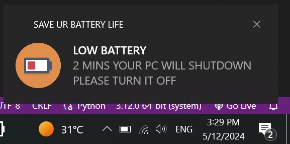

##### what does this script do ???
# THIS IS A SCHADULED SCRIPT THAT SENDS A POPUP MSG TO THE USER TO TURN OFF THE PC
# 1)-IF IT IS 20% OR LESS
[SHUTDOWN IN 2 MINS ]
# 2)-IF the the computer is  ON  WHILE IT'S CHARGING 
[AN ALERT NOTIFICATION WILL BE SENT TO THE  USER TO REMOVE THE PLUG AND THE SECOND TIME IF THE USER DIDN'T REMOVE THE PLUG A SHUTDOWN WILL BE IN 2 MINS]

## SUPPORT  [WINDOWS ONLY] 
